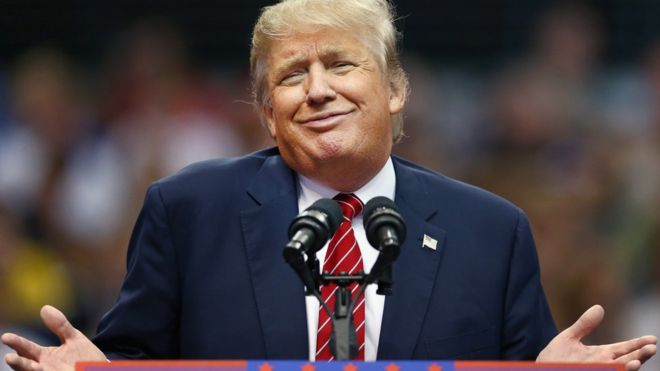
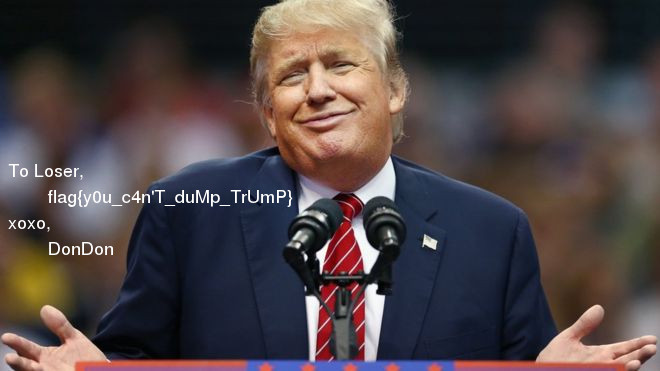

# TrumpTrump
  
Trump says that he never signs his picture and we get e, n, and a picture of Trump. It comes directly to us that the sign is the signature of RSA. A signature is to calculate s^d mod n for some s. The server provides the signature service but doesn't accept Trump's picture. We translate the bytes of Trump's picture into a big integer and module it by n. When we send the integer to the server, it refuses to sign, so we know that it's the number to sign. After finding its prime factors, we can represent the number into to integer.
```
s_1 = 109893 = 3*7*5233
s_2 = 120731889094158286484617210973106962345273328403938842471837847975209050781576030474171227293954443557802845133332389302509838952607755839943662245599125175370971428280705169554110228049186159493533245186665910385770616761523397758158738706294519377519224555343582848279252778839404558389579328957829822275628497010461810947545061654456993313593873667078964593865071061878691246163732153973587034631212230585652115860005015795467460386228859046508849919746972301840817635009176665675272483505914973166354435560644540415393365440753284931913808697236105421011125744062716884628030782468571537450155761699993214759
```
The server signs both the integers. We can recover the sign of the picture by multiplying the two signed integer and send it back to server. Then, it returns a long hex string starting with 'FFD8'. We store the string and convert it to binary and find the image.  

